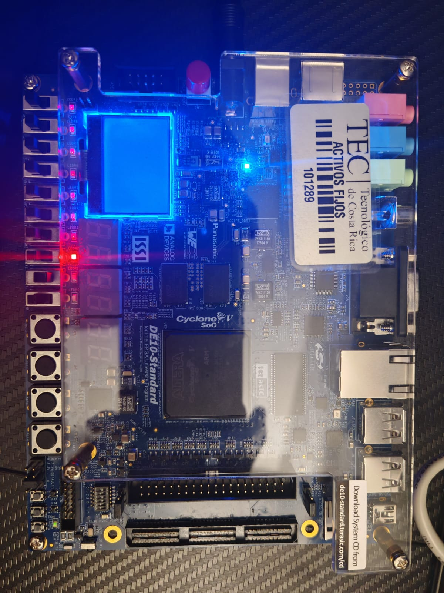
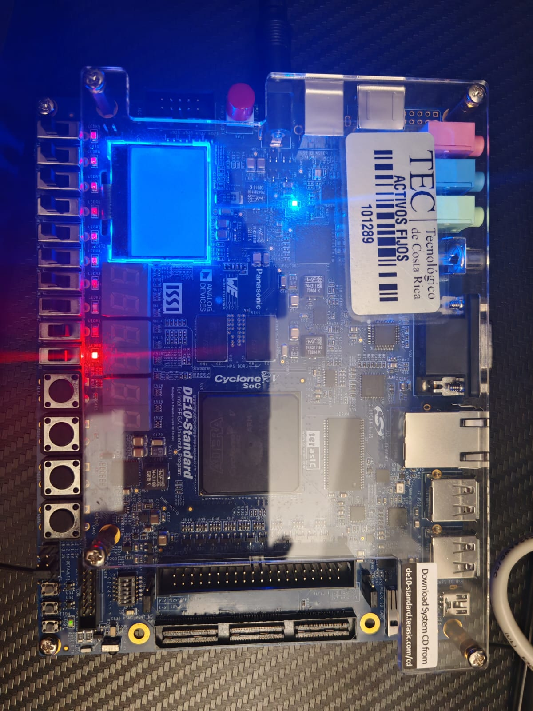
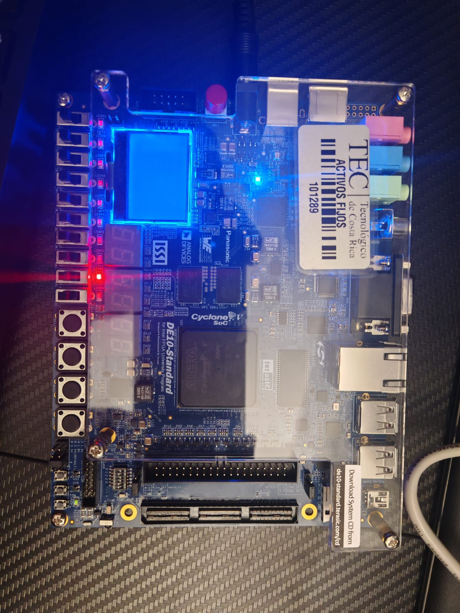
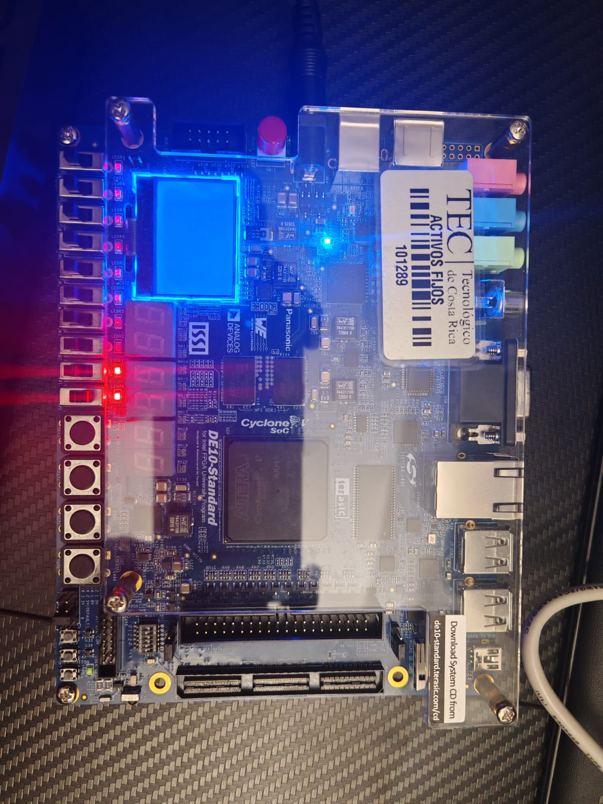

# Sprint 0 - Validación Física en FPGA

## Implementación

El verificador de paridad del Sprint 0 fue sintetizado e implementado físicamente en una tarjeta de desarrollo FPGA **Terasic DE10-Standard** utilizando Quartus Prime.

Para la validación en FPGA se utilizó la implementación estructural del verificador de paridad.

Las señales de entrada fueron asignadas a los switches físicos de la tarjeta de la siguiente forma:

| Señal | Switch |
|---|---|
| `data[0]` | SW0 |
| `data[1]` | SW1 |
| `data[2]` | SW2 |
| `data[3]` | SW3 |
| `p_even` | SW4 |
| `p_odd` | SW5 |

Las señales de salida fueron asignadas a los LEDs rojos:

| Señal | LED |
|---|---|
| `error_even` | LEDR0 |
| `error_odd` | LEDR1 |
| `valid` | LEDR2 |

El archivo `.qsf` contiene la configuración del dispositivo FPGA y las asignaciones físicas correspondientes de los pines:

- [Asignaciones de pines de Quartus](../../sprint0/quartus/parity_checker_top.qsf)

---

## Validación Física

El diseño fue programado en la FPGA y validado utilizando los switches físicos como entradas y los LEDs como salidas.

Se probaron cuatro casos representativos para verificar el funcionamiento correcto de la paridad y las posibles condiciones de error.

### Paridad válida

Entradas:

```text
data = 0000
p_even = 0
p_odd = 1
```

Salidas esperadas:

```text
error_even = 0
error_odd  = 0
valid      = 1
```

LEDs esperados:

```text
LEDR0 = OFF
LEDR1 = OFF
LEDR2 = ON
```

Resultado: **PASS**



---

### Error de paridad par

Entradas:

```text
data = 0000
p_even = 1
p_odd = 1
```

Salidas esperadas:

```text
error_even = 1
error_odd  = 0
valid      = 0
```

LEDs esperados:

```text
LEDR0 = ON
LEDR1 = OFF
LEDR2 = OFF
```

Resultado: **PASS**



---

### Error de paridad impar

Entradas:

```text
data = 0000
p_even = 0
p_odd = 0
```

Salidas esperadas:

```text
error_even = 0
error_odd  = 1
valid      = 0
```

LEDs esperados:

```text
LEDR0 = OFF
LEDR1 = ON
LEDR2 = OFF
```

Resultado: **PASS**



---

### Error en ambas paridades

Entradas:

```text
data = 0000
p_even = 1
p_odd = 0
```

Salidas esperadas:

```text
error_even = 1
error_odd  = 1
valid      = 0
```

LEDs esperados:

```text
LEDR0 = ON
LEDR1 = ON
LEDR2 = OFF
```

Resultado: **PASS**



---

## Cierre de Tiempos

El análisis estático de temporización fue realizado utilizando Quartus Prime.

Las restricciones de temporización están definidas en:

- [Restricciones de temporización](../../sprint0/quartus/parity_checker_top.sdc)

Se utilizó una referencia de temporización virtual con un período de **20 ns** para restringir las rutas combinacionales desde las entradas hasta las salidas.

El reporte final de temporización produjo los siguientes valores de peor caso de slack:

```text
Worst-case setup slack: +5.904 ns
Worst-case hold slack:  +3.990 ns
```

Ambos valores son positivos, lo que indica que las rutas analizadas cumplen con las restricciones temporales definidas.

El reporte también muestra que no quedaron rutas de entrada o salida sin restricciones:

```text
Unconstrained Input Ports       = 0
Unconstrained Input Port Paths  = 0
Unconstrained Output Ports      = 0
Unconstrained Output Port Paths = 0
```

El Timing Analyzer de Quartus finalizó correctamente con:

```text
0 errores
1 warning
```

El warning restante está relacionado con la cantidad de procesadores disponibles para Quartus durante la compilación y no representa una violación de temporización.

Por lo tanto, la implementación en FPGA alcanzó **cierre de tiempos para las restricciones definidas**.

El reporte completo de temporización está disponible en:

- [Reporte estructural de temporización](../../sprint0/output_files/structural_sta.rpt)

---

## Reportes de Implementación

Los reportes esenciales de Quartus generados durante la compilación de la implementación estructural son:

- [Reporte estructural del flujo de compilación](../../sprint0/output_files/structural_flow.rpt)
- [Reporte estructural de síntesis y mapeo](../../sprint0/output_files/structural_map.rpt)
- [Reporte estructural de temporización](../../sprint0/output_files/structural_sta.rpt)

El reporte de flujo confirma que la compilación en Quartus finalizó correctamente.

El reporte de mapeo contiene la información de síntesis y utilización de recursos lógicos.

El reporte de temporización contiene el análisis temporal y los resultados utilizados para verificar el cierre de tiempos.

---

## Resumen de Validación

El verificador de paridad estructural fue sintetizado, programado y validado correctamente en la FPGA.

Las pruebas físicas produjeron las salidas esperadas en los LEDs para los siguientes casos:

- Paridad válida.
- Error de paridad par.
- Error de paridad impar.
- Error simultáneo de paridad par e impar.

El análisis estático de temporización reportó valores positivos de setup slack y hold slack, además de cero rutas de entrada y salida sin restricciones.

Por lo tanto, la implementación física en FPGA y la validación de temporización fueron completadas correctamente.