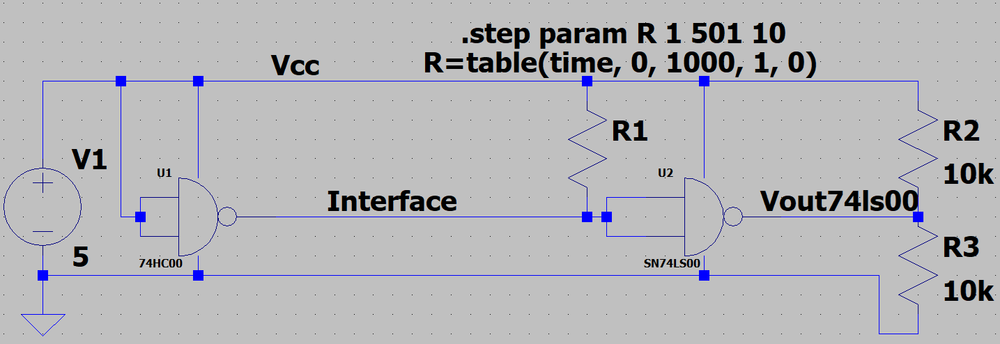
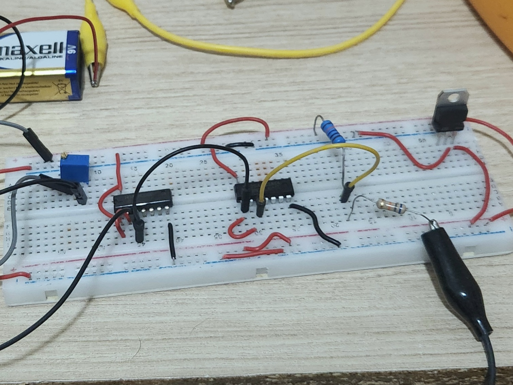
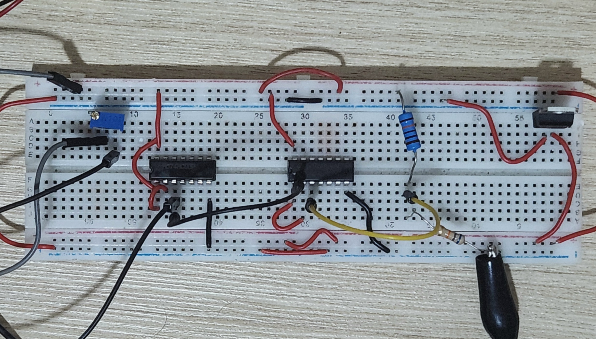
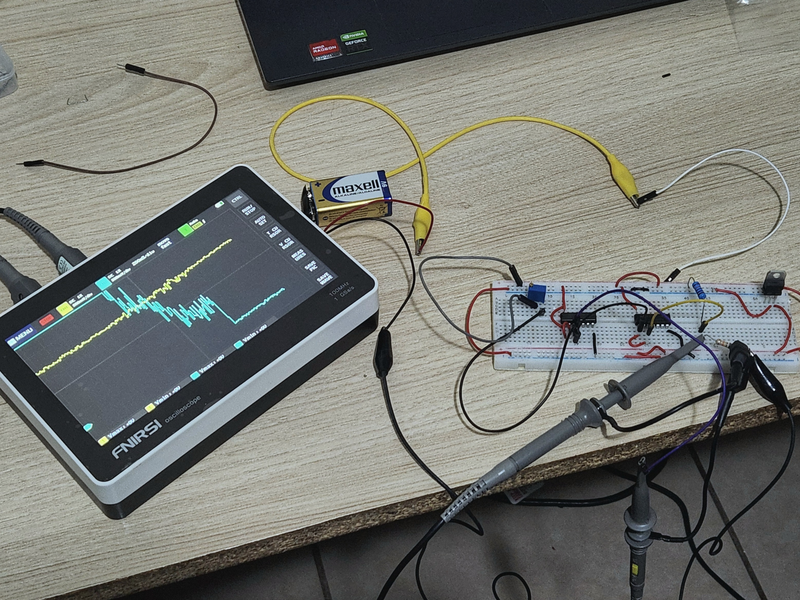
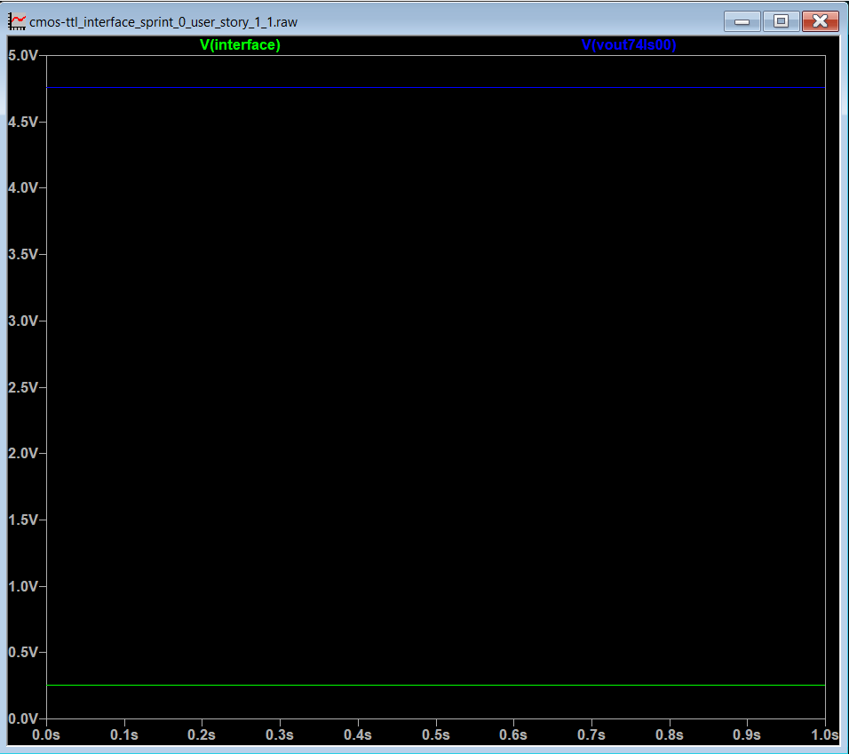
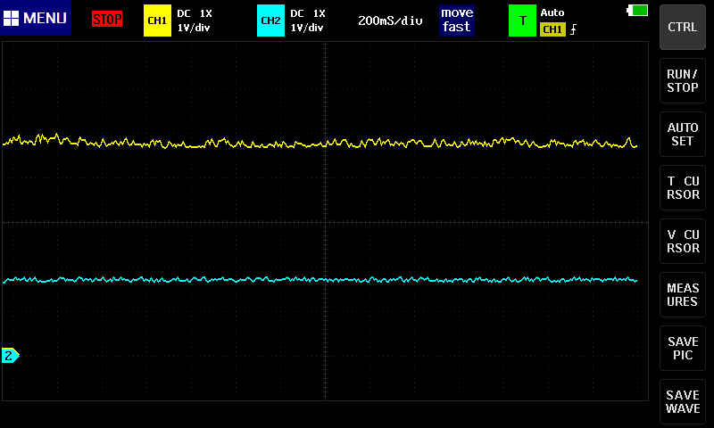
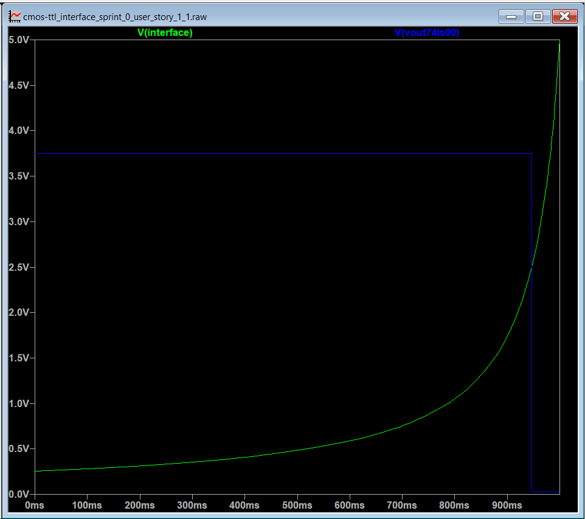
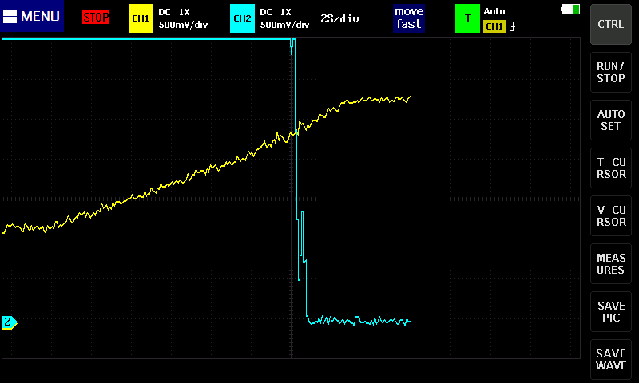
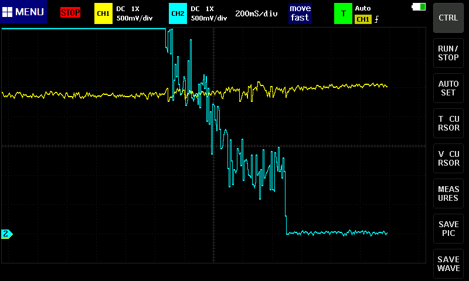

# Epic 1 — Caracterización de la interfaz TTL-CMOS

## User Story 1.1 — Interfaz directa CMOS → TTL

### 1. Objetivo
Construir y medir con osciloscopio la conexión entre
una salida CMOS (74HC00) y una entrada TTL (74LS00).

### 2. Materiales y equipo
- Protoboard y cables de conexión.
- Batería de 9 V.
- NAND CMOS 74HC00.
- NAND TTL 74LS00.
- Potenciómetro de precisión de 100 Ω W101.
- Regulador de tensión de 5 V LM7805.
- Multímetro digital.
- Osciloscopio Fnirsi-1013D.
- Resistencias de 66 kΩ y 100 kΩ.

### 3. Parámetros eléctricos
- Vcc = 5 V. 

### 4. Esquema del circuito

*Figura 1. Circuito de interfaz CMOS a TTL sin buffer en LTspice.*

### 5. Montaje físico

*Figura 2. Fotografía del circuito de interfaz CMOS a TTL sin buffer.*

*Figura 3. Fotografía cenital del circuito de interfaz CMOS a TTL sin buffer.*

*Figura 4. Fotografía del circuito de interfaz CMOS a TTL junto al osciloscopio.*

### 6. Resultados de la simulación
La simulación muestra los valores de la tensión en el nodo de interfaz (salida de la NAND CMOS)
y en la salida de la NAND TTL con una resistencia de carga en la interfaz de 1 kΩ.

*Figura 5. Gráfica de tensión contra tiempo de la tensión de interfaz y de la salida del circuito (NAND TTL) en LTspice.*

### 7. Medición con el osciloscopio
Se capturó con el osciloscopio el valor de CD estático de las mismas dos señales.

*Figura 6. Resultado del osciloscopio de las tensiones en ambas compuertas. El canal 1 (en amarillo) muestra la tensión de salida de la NAND TTL; y el canal 2 (en celeste), la de la NAND CMOS.*

## User Story 1.2 — Simulación de carga (Fan-Out)

### 1. Objetivo
Capturar con el osciloscopio y en simulación la degradación de señal que
provoca el fallo lógico en la compuerta TTL.

### 2. Materiales y equipo
- Protoboard y cables de conexión.
- Batería de 9 V.
- NAND CMOS 74HC00.
- NAND TTL 74LS00.
- Potenciómetro de precisión de 100 Ω W101.
- Regulador de tensión de 5 V LM7805.
- Multímetro digital.
- Osciloscopio Fnirsi-1013D.
- Resistencias de 66 kΩ y 100 kΩ.

### 3. Parámetros eléctricos
- Vcc = 5 V.
- La resistencia del potenciómetro varió de 100 Ω a 40 Ω.

<!-- ### 4. Esquema del circuito

*Figura 1. Circuito de interfaz CMOS a TTL sin buffer en LTspice.* -->

<!-- ### 5. Montaje físico

*Figura 2. Fotografía del circuito de interfaz CMOS a TTL sin buffer.*

*Figura 3. Fotografía cenital del circuito de interfaz CMOS a TTL sin buffer.* -->

### 4. Resultados de la simulación
La simulación realiza un barrido en el valor de la resistencia de 1 kΩ a 0 Ω
mientras muestra los valores de la tensión en el nodo de interfaz (salida de la NAND CMOS)
y en la salida de la NAND TTL.

*Figura 7. Gráfica de tensión contra tiempo de la tensión de interfaz y de la salida del circuito (NAND TTL) en LTspice.*

### 5. Medición con el osciloscopio
Se capturó con el osciloscopio la degradación de la salida con dos escalas de tiempo.
En un caso se usó una escala de 2s/división para capturar el proceso completo de aumento en la tensión nivel bajo de la NAND CMOS;
y seguidmante, una escala de 200ms/división para capturar la degradación de la señal únicamente y con mayor detalle.
Además del osciloscopio se utilizó un multímetro digital para precisar la tensión de la NAND CMOS 
y el valor de resistencia del potenciómetro que producen la ruptura de la señal.

*Figura 8. Resultado del osciloscopio con 2s/división.*

*Figura 9. Resultado del osciloscopio con 200ms/división.*

### 6. Resultados de la medición
- Se encontró con el multímetro que la tensión en la NAND CMOS que causa la degradación de la señal en la NAND TTL fue de 2,39 V.
    - La medición del osciloscopio apoya esta medición ya que oscila alrededor de ese valor como se observa en la figura 6.
- Se encontró que la resistencia del potenciómetro en este mismo punto fue de 42,3 Ω.

### 7. Conclusiones de User Story 1.1
La tensión y resistencia encontradas en la simulación y la medición se comparan en la siguiente tabla
| Componente | Simulado | Medido |Error  |
|-----------|-------|------|----|
| Potenciómetro (Ω) | 53,3   | 42,3    |21%    |
| NAND CMOS (V)| 2,50     |2,39    |4%    |

La principal fuente de discrepancia es el comportamiento altamente ideal de la compuerta 74LS00 (NAND TTL) en LTspice, 
mientras que la compuerta medida muestra un comportamiento más irregular en la zona prohibida.

---

---

## User Story 1.3 — Análisis matemático y Root Cause

### 1. Objetivo
Utilizar la Ley de Ohm sobre la resistencia de fallo del potenciómetro para calcular la corriente total de carga.
Demostrar con los datasheets cómo al exceder la capacidad de corriente en nivel bajo (𝐼𝑂𝐿) se eleva
el 𝑉𝑂𝐿 del CMOS por encima del umbral 𝑉𝐼𝐿 de la NAND TTL, y calcular a cuántas compuertas
equivalentes (basado en el 𝐼𝐼𝐿 estándar de TTL) corresponde esta sobrecarga teórica.

### 2. Materiales y equipo
- Protoboard y cables de conexión.
- Batería de 9 V.
- NAND CMOS 74HC00.
- NAND TTL 74LS00.
- Potenciómetro de precisión de 100 Ω W101.
- Regulador de tensión de 5 V LM7805.
- Multímetro digital.
- Osciloscopio Fnirsi-1013D.
- Resistencias de 66 kΩ y 100 kΩ.

### 3. Parámetros eléctricos
- Vcc = 5 V.
- Resistencia del potenciómetro en 42.3 Ω.

### 4. Ley de Ohm en el potenciómetro para hallar IOL
La corriente 𝐼𝑂𝐿 (current output low) de la NAND CMOS indicada en la datasheet indica la corriente que puede recibir el IC
con un valor lógico de 0. Exceder este límite causa que el IC no pueda mantener con certeza el valor lógico esperado.
Esto quiere decir que exceder el valor de 𝐼𝑂𝐿 provoca un aumento en la V𝑂𝐿 (voltage output low)
que eventualmente puede sobrepasar el valor que la lógica digital considera un 0. En este caso la lógica a la que se conecta el IC CMOS es un IC TTL,
de aquí la pertinencia de hallar experimentalmente el valor de 𝐼𝑂𝐿 soportado en esta interfaz particular.

Para esto se calculará 𝐼𝑂𝐿 al momento del fallo lógico a partir de las mediciones obtenidas.
Aplicando la ley de corrientes de Kirchhoff, se puede formar un nodo donde

$I_{OL} = I_{\text{potentiometer}} + I_{IL}$

Donde 𝐼potentiometer es la corriente en el potenciómetro
y 𝐼I𝐿 (current input low) es la corriente que emiten conjuntamente las entradas de la NAND TTL cuando su valor lógico es 0.

Se puede aplicar la ley de Ohm para hallar la corriente que fluía por el potenciómetro hacia la NAND CMOS en el momento en que la señal de salida se degrada.
Para esto se ha de hallar la tensión en el potenciómetro, sea esta Vpotentiometer, y usar su valor de resistencia, 42,3 Ω.
Aplicando la ley de tensiones de Kirchhoff, esta tensión se encuentra con la siguiente ecuación:

$V_{\text{potentiometer}} = V_{CC} - V_{\text{interface}}$

Por tanto 𝐼potentiometer equivale a

$I_{\text{potentiometer}} = \frac{V_{CC} - V_{\text{interface}}}{42.3\,\Omega}$

$I_{\text{potentiometer}} = \frac{(5.0 - 2.39)\,\text{V}}{42.3\,\Omega}$

$I_{\text{potentiometer}} = 61.7 mA$

<!--
Según la hoja de datos del IC 74LS00 de Texas Instruments [1]

$I_{IL} = 0.4\,\text{mA}$

Es relevante notar que 𝐼potentiometer >> 𝐼I𝐿, esto se debe a que una compuerta es capaz de alimentar muchas otras
y en este caso el potenciómetro simula ser el resto de compuertas que se pueden soportar antes de degradarse la señal.
 
Seguidamente, 

$I_{OL} = 61.7\,\text{mA} + 0.4\,\text{mA}$

$I_{OL} = 62.1\,\text{mA}$ -->

Para calcular a cuántas compuertas equivalentes corresponde esta sobrecarga se usará 𝐼I𝐿 Según la hoja de datos del IC 74LS00 de Texas Instruments [1] (0,4 mA)

$\text{Compuertas equivalentes} = \frac{61.7\,\text{mA}}{0.4\,\text{mA}}$

$\text{Compuertas equivalentes} = 164.25$

Sumando la compuerta conectada, la cantidad máxima de 74LS00 alimentados por el 74HC00
antes de sufrir degradación de la señal por fan-out es de 165.25.

### 5. Justificación teórica

Según el modelo digital de un transistor CMOS aplicando la modulación de ancho de canal,
en la región de saturación existe una relación aproximadamente lineal entre la tensión y la corriente
que se comporta similar a una resistencia. Debido a esto, al aumentar 𝐼O𝐿,
más corriente atraviesa el transistor de pull down a la salida de la NAND y la tensión de salida aumenta, VO𝐿.

<!-- 

---

## User Story 1.4 — Mitigación

### 23. Circuito de adaptación

### 24. Procedimiento

### 25. Resultados

### 26. Comparación antes/después

---

## 27. Conclusiones del Epic 1

## 28. Evidencias
-->

## References

[1] Texas Instruments, *SN74LS00 Quadruple 2-Input Positive-NAND Gates*.
[Datasheet](https://www.ti.com/lit/ds/symlink/sn74ls00.pdf)

[2] Nexperia, *74HC00; 74HCT00 — Quad 2-input NAND gate*.
[Datasheet](https://assets.nexperia.com/documents/data-sheet/74HC_HCT00.pdf)