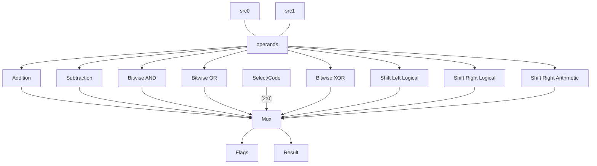

# alu_param

## Purpose

Describes an N-bit ALU with the following operatiors:
- ADD, Addition
- SUB, Subtraction
- AND, Bitwise AND
- OR, Bitwise OR
- XOR, Bitwise XOR
- SLL, Shift Left Logical
- SRL, Shift Right Logical
- SRA, Shift Right Arithmetic
Produces the following flags:
- Zero
- Negative
- Carry
- Overflow

## Interface

| Signal                      | Direction | Width |
|-----------------------------|-----------|-------|
| `code`                      | Input     | 3 |
| `a`                         | Input     | N |
| `b`                         | Input     | N |
| `result`                    | Output     | N |
| `flags`                     | Output     | 4 |

## Internal Architecture


## Submodule Instantiation
### Addition/Subtraction module with two's complement
```sv
    case (code)
      ADD, SUB: begin
        b_mod = (code == ADD) ? b : ~b;
        add_one[0] = (code == SUB);
        full_res = {1'b0, a} + {1'b0, b_mod} + {1'b0, add_one};
        result = full_res[WIDTH - 1:0];
      end
      ... // Other operator cases
```
