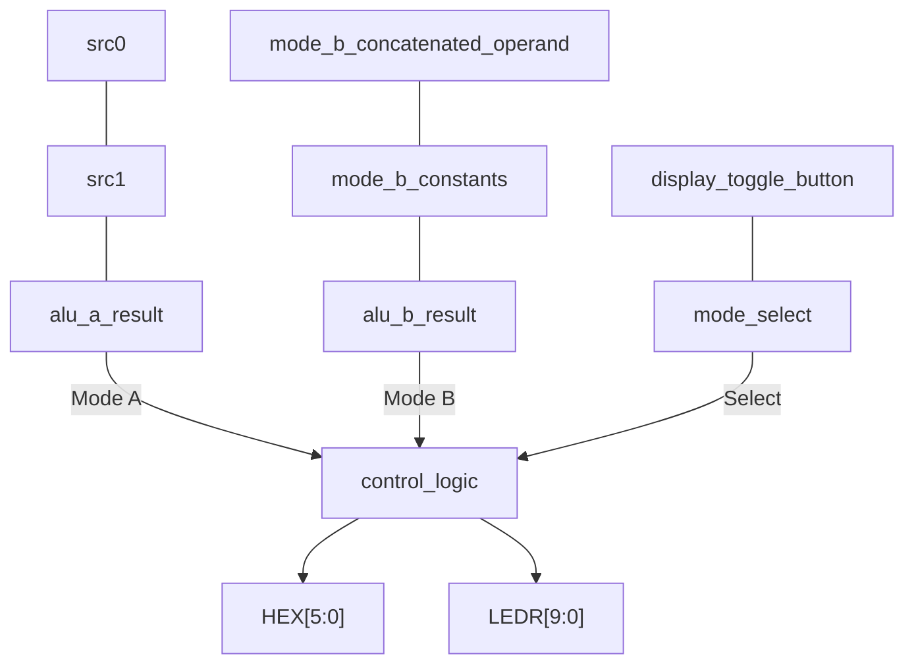

# control_logic

## Purpose

Receives the signed operands and results of ALUs A and B, and the mode select and display toggle signals.
Outputs the selected values adapted to the FPGA's 7-segment displays.

## Interface

| Signal                      | Direction | Width |
|-----------------------------|-----------|-------|
| `mode_select`               | Input     | 1 |
| `display_toggle_button`     | Input     | 1 |
| `src0`                      | Input     | 3 |
| `src1`                      | Input     | 3 |
| `alu_a_result`              | Input     | 3 |
| `alu_b_concatenated_operand`| Input     | 8 |
| `alu_b_multiplexed_operand` | Input     | 8 |
| `alu_b_result`              | Input     | 8 |
| `seven_segment_display_...` | Output    | 7 |

There is one 7-segment display output for each available in the FPGA named `seven_segment_display_one` to `seven_segment_display_six`
## Internal Architecture


## Submodule Instantiation
### 3-bit BCD adapters
```sv
// 7-segment displays BCD and adapters for 3-bit numbers.
    logic [6:0] mode_a_src0_segments_abcdefg;
    logic [6:0] mode_a_src1_segments_abcdefg;
    logic [6:0] mode_a_result_segments_abcdefg;
    // src 0
    three_bit_absolute_value_binary_to_7_segment_converter mode_a_src0_adapter (
        .in   (src0),
        .segments_abcdefg  (mode_a_src0_segments_abcdefg)
    );
    // src 1
    three_bit_absolute_value_binary_to_7_segment_converter mode_a_src1_adapter (
        .in   (src1),
        .segments_abcdefg  (mode_a_src1_segments_abcdefg)
    );
    // ALU A result
    three_bit_absolute_value_binary_to_7_segment_converter mode_a_result_adapter (
        .in   (alu_a_result),
        .segments_abcdefg  (mode_a_result_segments_abcdefg)
    );
```
### 8-bit BCD adapters
```sv
// 7-segment displays BCD and adapters for 8-bit numbers.
    logic [6:0] mode_b_concatenated_operand_ones_segments_abcdefg;
    logic [6:0] mode_b_concatenated_operand_tens_segments_abcdefg;
    logic [6:0] mode_b_concatenated_operand_hundreds_segments_abcdefg;
    logic [6:0] mode_b_multiplexed_operand_ones_segments_abcdefg;
    logic [6:0] mode_b_multiplexed_operand_tens_segments_abcdefg;
    logic [6:0] mode_b_multiplexed_operand_hundreds_segments_abcdefg;
    logic [6:0] mode_b_result_ones_segments_abcdefg;
    logic [6:0] mode_b_result_tens_segments_abcdefg;
    logic [6:0] mode_b_result_hundreds_segments_abcdefg;
    eight_bit_absolute_value_binary_to_7_segment_BCD_converter mode_b_concatenated_operand_adapter (
        .in   (alu_b_concatenated_operand),
        .ones_segments_abcdefg  (mode_b_concatenated_operand_ones_segments_abcdefg),
        .tens_segments_abcdefg  (mode_b_concatenated_operand_tens_segments_abcdefg),
        .hundreds_segments_abcdefg  (mode_b_concatenated_operand_hundreds_segments_abcdefg)
    );
    eight_bit_absolute_value_binary_to_7_segment_BCD_converter mode_b_multiplexed_operand_adapter (
        .in   (alu_b_multiplexed_operand),
        .ones_segments_abcdefg  (mode_b_multiplexed_operand_ones_segments_abcdefg),
        .tens_segments_abcdefg  (mode_b_multiplexed_operand_tens_segments_abcdefg),
        .hundreds_segments_abcdefg  (mode_b_multiplexed_operand_hundreds_segments_abcdefg)
    );
    eight_bit_absolute_value_binary_to_7_segment_BCD_converter mode_b_result_adapter (
        .in   (alu_b_result),
        .ones_segments_abcdefg  (mode_b_result_ones_segments_abcdefg),
        .tens_segments_abcdefg  (mode_b_result_tens_segments_abcdefg),
        .hundreds_segments_abcdefg  (mode_b_result_hundreds_segments_abcdefg)
    );
```
