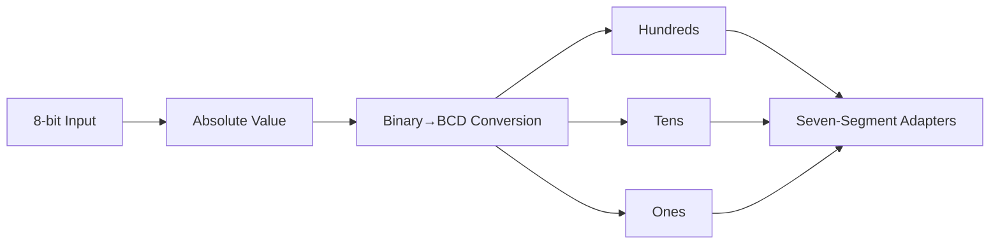

# Eight-bit absolute value binary to seven-segment BCD converter

## Purpose

Relates the absolute value of an 8-bit number to its decimal representation in three 7-segment displays.

## Interface

| Signal                      | Direction | Width |
|-----------------------------|-----------|-------|
| `in`                        | Input     | 8 |
| `ones_segments_abcdefg`     | Output    | 7 |
| `tens_segments_abcdefg`     | Output    | 7 |
| `hundreds_segments_abcdefg` | Output    | 7 |

## Internal Architecture


## Submodule Instantiation
### BCD behavioural description
```sv
    // BCD
    logic [3:0] ones; // use 4 bits because a 7-segment display uses 4 bits and is the least amount of bit necessary to represent 10 different values.
    logic [3:0] tens;
    logic [3:0] hundreds;

    logic [7:0] ones_value;
    logic [7:0] tens_value;
    logic [7:0] hundreds_value;

    assign ones_value     = absolute_value_of_in % 8'd10;
    assign tens_value     = (absolute_value_of_in / 8'd10) % 8'd10;
    assign hundreds_value = absolute_value_of_in / 8'd100;
    // 
    assign ones     = ones_value[3:0];
    assign tens     = tens_value[3:0];
    assign hundreds = hundreds_value[3:0];
```
