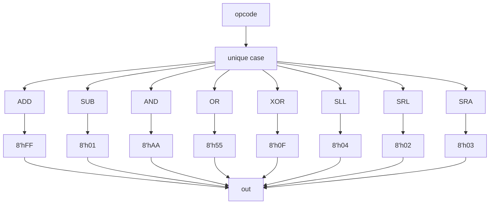

# mode_b_constants

## Purpose

Returns an 8-bit constant corresponding to an opcode as described in the design specs.

## Interface

| Signal                      | Direction | Width |
|-----------------------------|-----------|-------|
| `control`                   | Input     | 3 |
| `alu_b_multiplexed_operand` | Output    | 8 |

## Internal Architecture


## Submodule Instantiation
### Constants Mux
```sv
  // Define ALU B multiplexed operand
  always_comb begin
  unique case (alu_op_t'(control))   
    ADD: alu_b_multiplexed_operand = 8'hFF;
    SUB: alu_b_multiplexed_operand = 8'h01;
    AND: alu_b_multiplexed_operand = 8'hAA;
    OR:  alu_b_multiplexed_operand = 8'h55;
    XOR: alu_b_multiplexed_operand = 8'h0F;
    SLL: alu_b_multiplexed_operand = 8'h04;
    SRL: alu_b_multiplexed_operand = 8'h02;
    SRA: alu_b_multiplexed_operand = 8'h03;
    default: alu_b_multiplexed_operand = 8'h00; 
  endcase
  end
```
