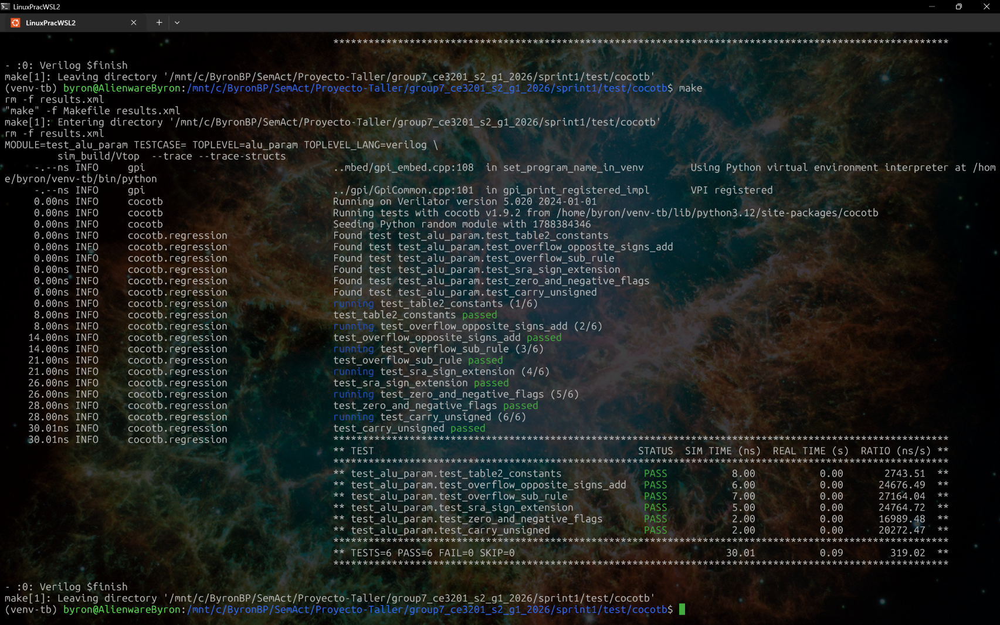
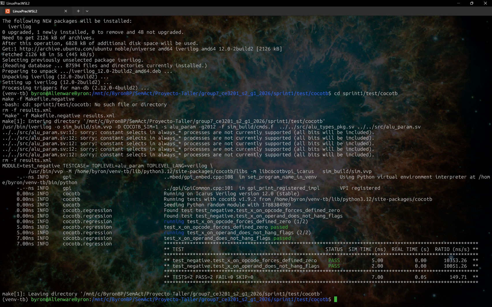
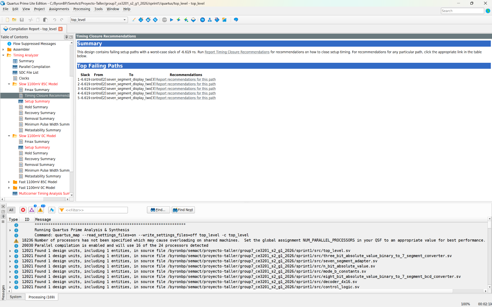

# Resultados de Verificación — Sprint 1

## US 3.1 — Pruebas Funcionales y Edge Cases

**Entorno:** cocotb 1.9.2 + Verilator 5.020, DUT `alu_param`.
**Comando:** `make` desde `sprint1/test/cocotb/` (corre WIDTH=8 y WIDTH=32).
**Resultado WIDTH=8:** 6/6 pruebas pasaron (`TESTS=6 PASS=6 FAIL=0 SKIP=0`).
**Resultado WIDTH=32:** 5/6 pasaron, 1 omitida (`TESTS=6 PASS=5 FAIL=0 SKIP=1`) — se omite `test_table2_constants` porque esos vectores son específicos de un ALU de 8 bits (Tabla 2 del backlog).

| Prueba | Qué valida | Resultado |
|---|---|---|
| `test_table2_constants` | Los 8 opcodes contra los vectores de la Tabla 2 del backlog | PASS |
| `test_overflow_opposite_signs_add` | ADD con signos opuestos → sin falso positivo de overflow; signos iguales que desbordan → overflow=1 | PASS |
| `test_overflow_sub_rule` | SUB: overflow=0 con signos iguales; overflow=1 con signos distintos que desbordan el rango [-128,127] | PASS |
| `test_sra_sign_extension` | SRA replica el bit de signo (MSB=1 con a=0x80); SRL inserta 0 en el mismo caso | PASS |
| `test_zero_and_negative_flags` | Banderas Zero y Negative en ADD(5,-5) y ADD(0,-1) | PASS |
| `test_carry_unsigned` | Carry=1 en ADD(0xFF, 0x01) (acarreo real fuera del bus) | PASS |

### Evidencia (captura de la corrida)



### Log de la corrida

```
running test_table2_constants (1/6)
  8.00ns  test_table2_constants passed
running test_overflow_opposite_signs_add (2/6)
 14.00ns  test_overflow_opposite_signs_add passed
running test_overflow_sub_rule (3/6)
 21.00ns  test_overflow_sub_rule passed
running test_sra_sign_extension (4/6)
 26.00ns  test_sra_sign_extension passed
running test_zero_and_negative_flags (5/6)
 28.00ns  test_zero_and_negative_flags passed
running test_carry_unsigned (6/6)
 30.01ns  test_carry_unsigned passed

TESTS=6 PASS=6 FAIL=0 SKIP=0    30.01ns   0.07s   456.19 ns/s
```

### Pendientes / notas

- **Polaridad de `carry` en SUB** no está verificada ni documentada como convención del equipo (¿1 significa acarreo o préstamo?). Falta decidir y agregar el assert correspondiente en `test_carry_unsigned`.
- Waveform (`.vcd`) generado por Verilator en `sim_build/` con `--trace --trace-structs`; adjuntar captura aquí cuando se abra en GTKWave.

## US 3.2 — Pruebas Negativas (Inyección 'X')

**Entorno:** cocotb 1.9.2 + Icarus Verilog 12.0 (4-state), DUT `alu_param`.
**Comando:** `make` desde `sprint1/test/cocotb/` (corre WIDTH=8 y WIDTH=32).
**Resultado:** 2/2 pruebas pasaron en ambos anchos (`TESTS=2 PASS=2 FAIL=0 SKIP=0`).

### Evidencia (captura de la corrida)



| Prueba | Qué valida | Resultado |
|---|---|---|
| `test_x_on_opcode_forces_defined_zero` | code forzado a xxx/x1x/1xx/xx1/zzz (fuera del enum) → result definido y en 0 | PASS |
| `test_x_on_operand_does_not_hang_flags` | a forzado a 'x' y luego restaurado a valor válido → flags recupera valor definido, sin latch | PASS |

### Nota de la herramienta

Icarus reportó durante la compilación:
```
../../src/alu_param.sv:12: sorry: constant selects in always_* processes are not currently supported (all bits will be included).
```
No detiene la simulación, pero indica una limitación de modelado a revisar (declaraciones de ancho variable dentro del `always_comb` de `alu_param.sv`). Queda como observación para Epic 1, no bloquea 3.2.

### Log de la corrida

```
running test_x_on_opcode_forces_defined_zero (1/2)
 5.00ns  test_x_on_opcode_forces_defined_zero passed
running test_x_on_operand_does_not_hang_flags (2/2)
 7.00ns  test_x_on_operand_does_not_hang_flags passed

TESTS=2 PASS=2 FAIL=0 SKIP=0   7.00ns   0.05s   149.71 ns/s
```

## US 3.4 — Timing (STA)

**Herramienta:** Quartus Prime TimeQuest Timing Analyzer.
**Constraint aplicado:** `set_max_delay -from [get_ports {SW[*] KEY[*]}] -to [get_ports {HEX*[*] LEDR[*]}] 20.0` (`sprint1/sdc/timing_constraints.sdc`).

- Compilación exitosa con el `.sdc` cargado en Settings → TimeQuest Timing Analyzer: ✔
- tpd máximo reportado: **26.619 ns** (slack: **-6.619 ns**, no cumple)
- Cumple el límite de 20 ns: ✘

### Ruta crítica (Modelo Slow 1100mV 85°C)

| Slack | From | To |
|---|---|---|
| -6.619 ns | `control[2]` | `seven_segment_display_two[3]` |

**Causa probable:** `control[2]` (bit del opcode) atraviesa `control_logic` hasta el `eight_bit_absolute_value_binary_to_7_segment_BCD_converter`, que internamente usa 12 megafunciones `lpm_divide` (división/módulo por 10 para conversión binario→BCD) — operación combinacional costosa en LUTs/niveles lógicos, probable cuello de botella.

**Acción pendiente:** optimizar el conversor BCD (ej. reemplazar división por el algoritmo Double Dabble, que es shift-and-add y mucho más rápido en combinacional puro) o evaluar si el AC de 20 ns es alcanzable sin pipeline dado que el sistema es puramente combinacional.

### Evidencia

