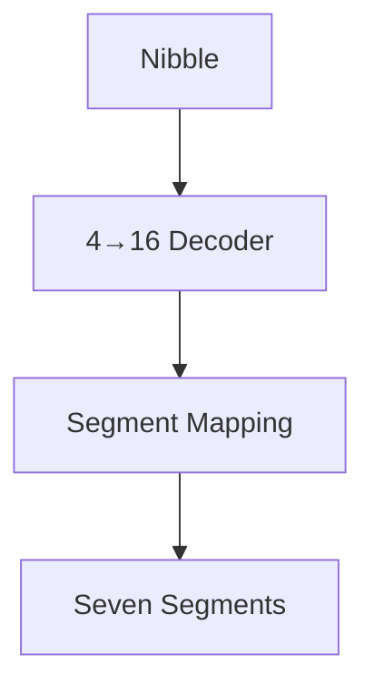

# seven_segment_adapter

## Purpose

Receives a nibble and returns its 7-segment hexadecimal representation in abcdefg order.
The output is negated because the FPGA uses common anode LEDs for the 7-segment displays.

## Interface

| Signal                      | Direction | Width |
|-----------------------------|-----------|-------|
| `in`                        | Input     | 3 |
| `segments_abcdefg`          | Output    | 8 |

## Internal Architecture

## Output negation
```sv
module seven_segment_adapter
(
    input  logic [3:0] in,
    output logic [6:0] segments_abcdefg
);
    logic a, b, c, d, e, f, g;
    .
    .
    .
assign segments_abcdefg = {~a,~b,~c,~d,~e,~f,~g};
```
