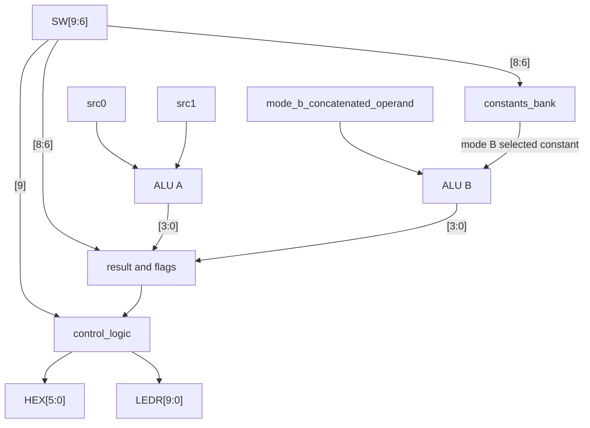

# top_level

## Purpose

Top-level module that connects the physical FPGA inputs and outputs with the control logic, ALU datapath, display system, and status LEDs.

## Interface

| FPGA signals | In-code singals            | Direction | Width | FPGA element   |
|--------------|----------------------------|-----------|-------|-------------------|
| `SW[2:0]`    | `src0`                     | Input     |       | Physical switches |
| `SW[5:3]`    | `src1`                     | Input     |       | Physical switches |
| `SW[9:6]`    | `control`                  | Input     |       | Physical switches |
| `KEY[0]`     | `display_toggle_button`    | Input     |       | Button |
| `HEX[5:0]`   | `seven_segment_display_...`| Output    |       | Seven-segment displays |
| `LEDR[9:0]`  | (ALU flags / sign bits)    | Output    |       | Status LEDs |

The displayed flags are `zero`, `carry`, `negative`, and `overflow`.
## Internal Architecture



## Submodule Instantiation
### control_logic module
```sv
// Receives the operating mode and display toggle inputs, and the operands and results of the ALUs and outputs the values to display on the six 7-segment displays. 
    control_logic ctrl_logic (
        .mode_select (control[3]),
        .display_toggle_button (display_toggle_button),

        .src0 (src0),
        .src1 (src1),
        .alu_a_result (alu_a_result),

        .alu_b_concatenated_operand (alu_b_concatenated_operand),
        .alu_b_multiplexed_operand (alu_b_multiplexed_operand),
        .alu_b_result (alu_b_result),

        .seven_segment_display_one (seven_segment_display_one),
        .seven_segment_display_two (seven_segment_display_two),
        .seven_segment_display_three (seven_segment_display_three),
        .seven_segment_display_four (seven_segment_display_four),
        .seven_segment_display_five (seven_segment_display_five),
        .seven_segment_display_six (seven_segment_display_six)
    );
```
### alu_param module (ALU A)
```sv
    // Instantiate the 3-bit ALU (ALU A)
    alu_param #(
        .WIDTH(3)
    ) alu_a (
        .code   (alu_op_t'(control)), // Cast 4-bit input to enum
        .a      (src0),
        .b      (src1),
        .result (alu_a_result),
        .flags  (alu_a_flags)
    );
```
### alu_param module (ALU B)
```sv
    // Instantiate the 8-bit ALU (ALU B)
    alu_param #(
        .WIDTH(8)
    ) alu_b (
        .code   (alu_op_t'(control)), // Cast 4-bit input to enum
        .a      (alu_b_concatenated_operand),
        .b      (alu_b_multiplexed_operand),
        .result (alu_b_result),
        .flags  (alu_b_flags)
    );
```