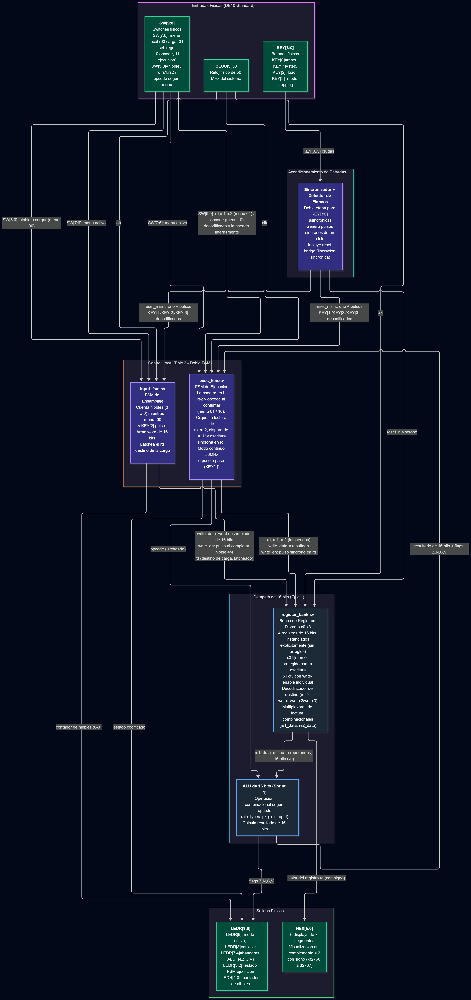

# Arquitectura del Sistema — Sprint 2

## Descripción General

El sistema evoluciona la ALU combinacional del Sprint 1 hacia una unidad de
ejecución secuencial local de 16 bits, integrando un banco de registros
discreto (x0-x3) que opera bajo el reloj físico `CLOCK_50`.

El control del sistema (menú local por nibbles y las FSMs de Ensamblaje
y Ejecución) forma parte del diseño planteado en este diagrama, pero su
implementación corresponde a Epic 2 y aún no está desarrollada.

## Diagrama de Bloques

## Componentes

### register_bank.sv

Banco de registros discreto de 16 bits (x0-x3). Cada registro se instancia
de forma explícita (sin arreglos multidimensionales), evitando inferencia
implícita de bloques de RAM en Quartus.

- **x0**: constante `16'h0000`, de solo lectura, permanentemente protegido
  contra escritura.
- **x1, x2, x3**: registros de propósito general, cada uno con su propia
  señal de write-enable (`we_x1`, `we_x2`, `we_x3`).
- **Decodificador de destino**: a partir de `rd` (2 bits), activa el
  enable del registro correspondiente. Si `rd = 2'b00` (x0), ningún
  enable se activa.
- **Multiplexores de lectura**: combinacionales, seleccionan `rs1_data` y
  `rs2_data` a partir de `rs1`/`rs2` para alimentar la ALU.

### ALU de 16 bits (Sprint 1)

Reutilizada del Sprint 1 sin modificaciones funcionales. Opera de forma
combinacional según el opcode definido en `alu_types_pkg::alu_op_t`,
calculando el resultado de 16 bits y las banderas de estado (Z, N, C, V).

## Pendiente (Epic 2)

La interacción detallada entre `input_fsm.sv` y `exec_fsm.sv` se
documentará en esta sección una vez implementadas ambas FSMs.
