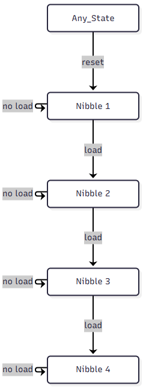
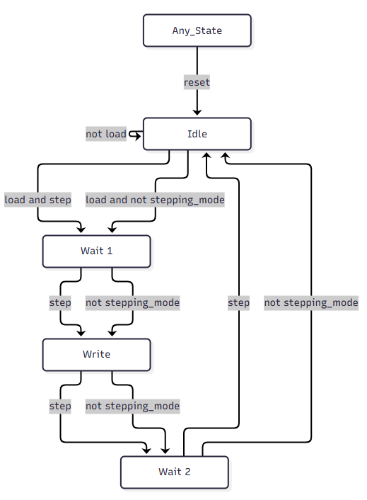

# FSMs de Entrada y Ejecución — Arquitectura

## Descripción General

Este documento contiene los diagramas de estado y las tablas de transición
de las dos FSMs que controlan el datapath de Sprint 2: `input_fsm.sv`
(ensamblaje serial de nibbles) y `exec_fsm.sv` (escritura controlada del
resultado de la ALU). Ambas FSMs usan un reset asíncrono activo en bajo
(`negedge reset`) y codifican su estado con literales de 2 bits en lugar de
un `typedef enum` (limitación de estilo conocida, registrada en
`architecture.md`).

## FSM de Entrada (`input_fsm.sv`)

### Propósito

Esta FSM se encarga de la entrada y ensamblaje de un número de 16 bits
mediante cuatro entradas sucesivas de un nibble (4 bits) cada una. Las
entradas se proveen en `SW[3:0]` de la FPGA física y se confirman con
`KEY[2]` (`load_pulse` en `top_level.sv`, habilitado solo cuando
`local_menu == 2'b00`).

### Estados

| Nombre del estado | `current_state` | Nibble guardado en este ciclo |
|---|---|---|
| Primer Nibble | `2'b11` | `out[3:0]` (menos significativo) |
| Segundo Nibble | `2'b10` | `out[7:4]` |
| Tercer Nibble | `2'b01` | `out[11:8]` |
| Cuarto Nibble | `2'b00` | `out[15:12]` (más significativo) |

La FSM cuenta **hacia abajo** de `2'b11` a `2'b00`. Al llegar a `2'b00`, una
bandera interna (`serial_assembly_FSM_finished`) se activa y bloquea
cualquier nueva entrada de nibble hasta que el módulo se reinicia.

### Diagrama de Estados



### Tabla de Transiciones

Las condiciones se evalúan en cada flanco positivo de reloj. Un reset
asíncrono activo en bajo puede llevar la FSM a Primer Nibble
(`current_state <= 2'b11`, `out <= 0`,
`serial_assembly_FSM_finished <= 0`) en cualquier momento, sin importar las
transiciones descritas abajo.

| Estado Actual | `current_state` | Condición | Acción | Estado Siguiente |
|---|---:|---|---|---:|
| Primer Nibble | `2'b11` | `step && !finished` | `out[3:0] <= nibble_input` | Segundo Nibble (`2'b10`) |
| Primer Nibble | `2'b11` | `!step` | Sin cambio | Primer Nibble (`2'b11`) |
| Segundo Nibble | `2'b10` | `step` | `out[7:4] <= nibble_input` | Tercer Nibble (`2'b01`) |
| Segundo Nibble | `2'b10` | `!step` | Sin cambio | Segundo Nibble (`2'b10`) |
| Tercer Nibble | `2'b01` | `step` | `out[11:8] <= nibble_input` | Cuarto Nibble (`2'b00`) |
| Tercer Nibble | `2'b01` | `!step` | Sin cambio | Tercer Nibble (`2'b01`) |
| Cuarto Nibble | `2'b00` | `step` | `out[15:12] <= nibble_input`; `serial_assembly_FSM_finished <= 1'b1` | Cuarto Nibble (`2'b00`) |
| Cuarto Nibble | `2'b00` | `!step` | Sin cambio | Cuarto Nibble (`2'b00`) |

Nota: una vez que `serial_assembly_FSM_finished` vale `1`, la condición
`step && !finished` al inicio del bloque `always` impide *cualquier*
actualización posterior de estado u `out` — la FSM permanece detenida en
Cuarto Nibble aunque `step` vuelva a pulsar, hasta que ocurra un reset.

## FSM de Ejecución (`exec_fsm.sv`)

### Propósito

Esta FSM se encarga de escribir el resultado de la ALU en el banco de
registros. `KEY[2]` (a través de `start_execute`, capturado por
`top_level.sv` como `start_execute_fsm`) lanza esta FSM, la cual tiene dos
comportamientos posibles según el modo de avance:

- **Modo continuo** (`stepping_mode = 0`): avanza al siguiente estado en
  cada flanco positivo de reloj.
- **Modo paso a paso** (`stepping_mode = 1`): solo avanza cuando el
  usuario pulsa `KEY[1]` (`step`).

### Estados

| Nombre del estado | `current_state` |
|---|---|
| Reposo (Idle) | `2'b11` |
| Primera Espera | `2'b10` |
| Escritura (Write) | `2'b01` |
| Segunda Espera | `2'b00` |

Esta FSM también cuenta hacia abajo
(`2'b11 → 2'b10 → 2'b01 → 2'b00 → 2'b11`), la misma convención de
codificación que `input_fsm.sv`.

### Diagrama de Estados



### Tabla de Transiciones

Las condiciones se evalúan en cada flanco positivo de reloj. Un reset
asíncrono activo en bajo puede llevar la FSM a Reposo
(`current_state <= 2'b11`, `current_state_delayed <= 2'b11`) en cualquier
momento. La FSM solo evalúa una transición cuando `step || ~stepping_mode`
es verdadero (es decir, en modo continuo siempre evalúa; en modo paso a
paso solo evalúa ante un pulso de `step`).

| Estado Actual | `current_state` | Condición | Acción | Estado Siguiente |
|---|---:|---|---|---:|
| Reposo | `2'b11` | `start_execute && (step \|\| !stepping_mode)` | Avanzar | Primera Espera (`2'b10`) |
| Reposo | `2'b11` | `!start_execute` o `!(step \|\| !stepping_mode)` | Permanecer (sin cambio) | Reposo (`2'b11`) |
| Primera Espera | `2'b10` | `step \|\| !stepping_mode` | Avanzar | Escritura (`2'b01`) |
| Primera Espera | `2'b10` | modo paso a paso retiene (`!step`) | Sin cambio | Primera Espera (`2'b10`) |
| Escritura | `2'b01` | `step \|\| !stepping_mode` | Avanzar | Segunda Espera (`2'b00`) |
| Escritura | `2'b01` | modo paso a paso retiene (`!step`) | Sin cambio | Escritura (`2'b01`) |
| Segunda Espera | `2'b00` | `step \|\| !stepping_mode` | Avanzar | Reposo (`2'b11`) |
| Segunda Espera | `2'b00` | modo paso a paso retiene (`!step`) | Sin cambio | Segunda Espera (`2'b00`) |

Nota de nomenclatura: el diagrama de estados usa el nombre `load` para
referirse a `start_execute` (la señal que en `top_level.sv` proviene de
`KEY[2]` en el menú `11`), y separa la condición
`start_execute && (step || !stepping_mode)` en dos aristas rotuladas
`load and step` y `load and not stepping_mode`, equivalentes a la fila de
Reposo de la tabla anterior.

### Generación de `write_enable`

`write_enable` **no** es un registro de salida de la máquina de estados;
se genera de forma combinacional a partir del estado actual y una copia
del mismo retrasada un ciclo (`current_state_delayed`, que se actualiza
cada ciclo sin importar la habilitación por `step`/`stepping_mode`):

```
write_enable = (current_state_delayed == 2'b10) && (current_state == 2'b01)
```

Esto garantiza que `write_enable` esté en alto durante **exactamente un
ciclo de reloj**, precisamente durante la transición
`Primera Espera → Escritura`, aunque la FSM permanezca varios ciclos
detenida en el estado `Escritura` porque el usuario está avanzando
manualmente. Sin `current_state_delayed`, `write_enable` permanecería en
alto todo el tiempo que la FSM se mantuviera en `Escritura`, lo cual en
modo paso a paso podría ser un número arbitrario de ciclos — esto causaría
que el banco de registros se escribiera en cada uno de esos ciclos en
lugar de una sola vez.

## Interacción entre las dos FSMs

`input_fsm.sv` y `exec_fsm.sv` no se comunican directamente entre sí; son
coordinadas por lógica combinacional y registrada en `top_level.sv`:

- El reset de `input_fsm` es `reset_n & ~execute_FSM_write_enable`: en el
  momento en que `exec_fsm` activa `write_enable` (completando una
  escritura en el banco de registros), `input_fsm` se limpia de forma
  síncrona, quedando lista para recibir un nuevo valor inmediato para la
  siguiente operación.
- `start_execute` de `exec_fsm` es una señal registrada
  (`start_execute_fsm`) que se activa cuando el usuario confirma el menú
  `11` (`KEY[2]`) y se limpia con el propio pulso de `write_enable` de
  `exec_fsm` — de modo que `exec_fsm` solo se ejecuta una vez por cada
  confirmación, sin importar cuántos ciclos pasen después en Reposo.