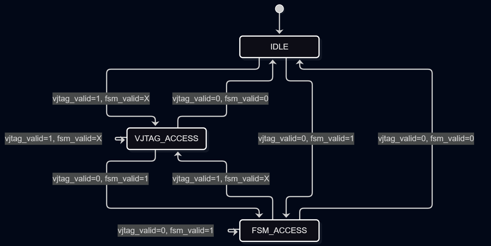

# Architecture - Sprint 3

## Árbitro de Bus

El árbitro gestiona el acceso al bus interno entre dos managers: vJTAG y Custom FSM.
vJTAG tiene prioridad fija sobre FSM en caso de acceso simultáneo.

### Diagrama de bloques

### Señales

| Señal | Dirección | Descripción |
|-------|-----------|-------------|
| `vjtag_valid` | Entrada | vJTAG solicita acceso al bus |
| `vjtag_addr` | Entrada | Dirección de vJTAG |
| `vjtag_data` | Entrada | Dato de vJTAG |
| `vjtag_ready` | Salida | Confirma transacción a vJTAG |
| `fsm_valid` | Entrada | FSM solicita acceso al bus |
| `fsm_addr` | Entrada | Dirección de FSM |
| `fsm_data` | Entrada | Dato de FSM |
| `fsm_ready` | Salida | Confirma transacción a FSM |
| `subordinate_ready` | Entrada | Subordinado listo para transacción |
| `mux_addr` | Salida | Dirección seleccionada al bus |
| `mux_data` | Salida | Dato seleccionado al bus |
| `mux_valid` | Salida | Valid hacia el subordinado |

### Estados

| Estado | Descripción |
|--------|-------------|
| `IDLE` | Ningún manager activo |
| `VJTAG_ACCESS` | vJTAG tiene el bus |
| `FSM_ACCESS` | FSM tiene el bus |

### Prioridad

Si vJTAG y FSM ponen `valid=1` simultáneamente, vJTAG gana y FSM se congela hasta que vJTAG libere el bus.